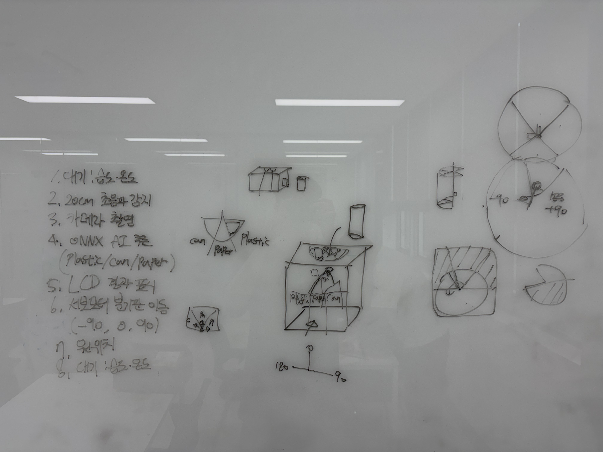
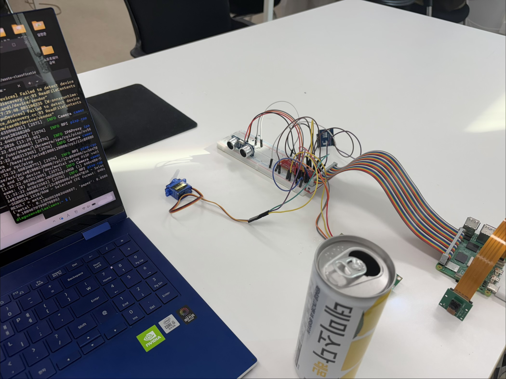
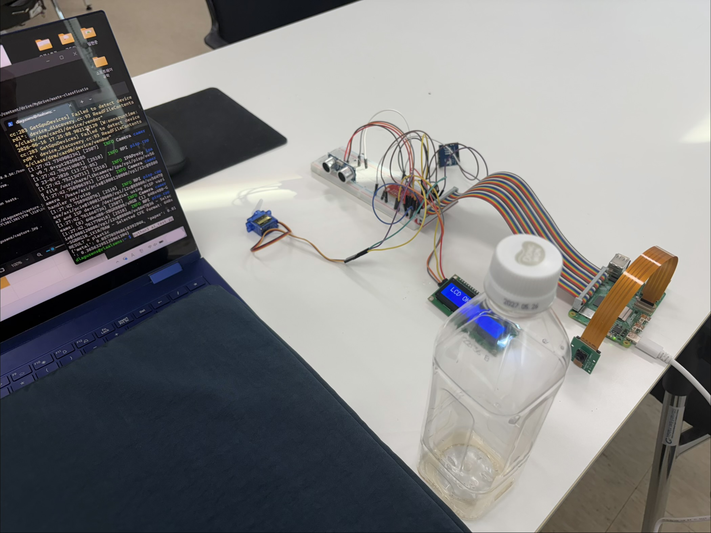
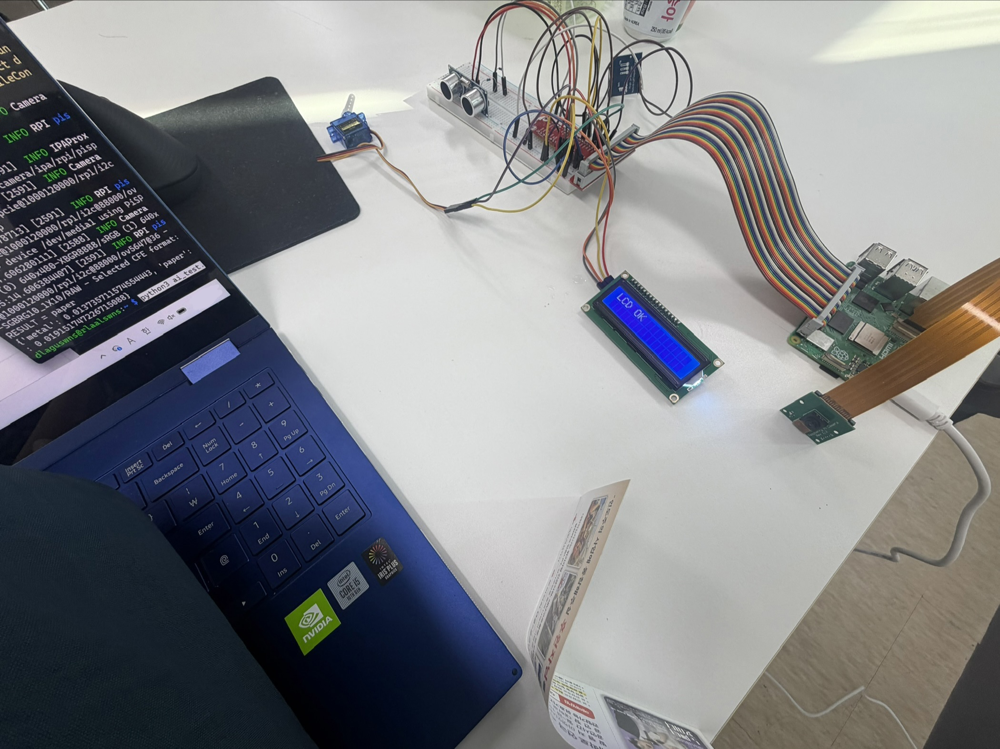
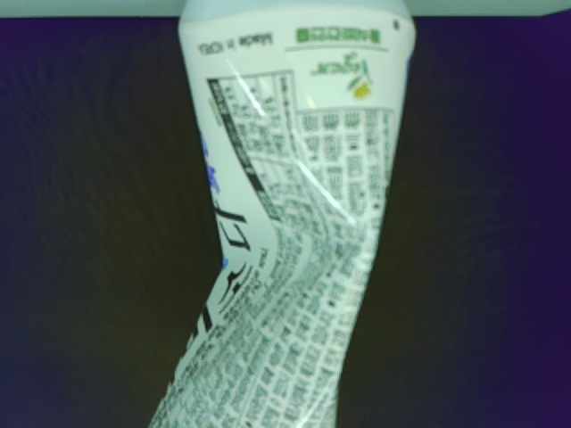

# ♻️ Smart Recycle — AI 자동 분리수거 시스템

라즈베리파이 기반의 **IoT 스마트 분리수거함**입니다.
초음파 센서로 사용자 접근을 감지하고, 카메라로 촬영한 쓰레기를 **YOLOv8(ONNX) 모델**로 분류(`plastic` / `paper` / `metal`)한 뒤, 서보 모터가 분기판을 회전시켜 해당 칸으로 분류해 줍니다. 대기 상태에서는 온·습도 정보를 LCD에 표시합니다.

> 📚 IoT / Edge Computing Term Project

---

## 🧩 시스템 구성

| 분류 | 부품 |
|------|------|
| 보드 | Raspberry Pi |
| 입력 | Pi Camera, 초음파 센서(HC-SR04), 온습도 센서(SHT30) |
| 출력 | I2C LCD (16x2), 서보 모터(SG90) |
| AI | YOLOv8n 폐기물 12-class 분류 모델 (ONNX 변환) |

### 동작 흐름

```
대기 (온·습도 표시)
   │  초음파 < 20cm
   ▼
사용자 접근 감지 → 카메라 촬영 → ONNX 추론
   │
   ▼
분류 결과(plastic / paper / metal)
   │
   ▼
서보 모터로 분기판 회전 → 해당 칸으로 투입
   │
   ▼
대기 상태로 복귀
```

### 분기판 각도 매핑

| 분류 | 서보 각도 |
|------|-----------|
| plastic | `-70°` |
| paper | `0°` |
| metal | `70°` |

---

## 0단계: 초안 작업



---

## 1단계: SSH 연결

라즈베리파이에 SSH로 원격 접속합니다.

---

## 2단계: 카메라 연결

`camera_test.py`

```python
from picamera2 import Picamera2
from time import sleep

picam2 = Picamera2()
picam2.start()

sleep(2)

picam2.capture_file("test.jpg")

print("사진 저장 완료!")
```

```bash
python3 camera_test.py
```

---

## 3단계: LCD 연결

`lcd_test.py`

```python
from RPLCD.i2c import CharLCD
from time import sleep

lcd = CharLCD(
    'PCF8574',
    0x27,
    cols=16,
    rows=2
)

lcd.write_string('Smart Recycle')

sleep(3)

lcd.clear()

lcd.write_string('LCD Success!')
```

```bash
python3 lcd_test.py
```

---

## 4단계: 초음파 센서 연결

`ultrasonic_test.py`

```python
import RPi.GPIO as GPIO
import time

TRIG = 23
ECHO = 24

GPIO.setmode(GPIO.BCM)

GPIO.setup(TRIG, GPIO.OUT)
GPIO.setup(ECHO, GPIO.IN)

GPIO.output(TRIG, False)

print("초음파 센서 초기화 중...")
time.sleep(2)

try:
    while True:

        GPIO.output(TRIG, True)
        time.sleep(0.00001)
        GPIO.output(TRIG, False)

        pulse_start = time.time()
        pulse_end = time.time()

        timeout = time.time()
        while GPIO.input(ECHO) == 0:
            pulse_start = time.time()

            if pulse_start - timeout > 0.05:
                raise TimeoutError("Echo 응답 없음")

        while GPIO.input(ECHO) == 1:
            pulse_end = time.time()

            if pulse_end - pulse_start > 0.05:
                raise TimeoutError("Echo 응답 시간 초과")

        pulse_duration = pulse_end - pulse_start

        distance = pulse_duration * 17150
        distance = round(distance, 2)

        if distance < 20:
            print("사용자 접근!")
        else:
            print(f"대기중... {distance} cm")

        time.sleep(0.3)

except KeyboardInterrupt:
    print("프로그램 종료")
    GPIO.cleanup()

except Exception as e:
    print("오류:", e)
    GPIO.cleanup()
```

```bash
python3 ultrasonic_test.py
```

---

## 5단계: 온도·습도 센서 연결

`sht30_test.py`

```python
import time
import board
import busio
import adafruit_sht31d

i2c = busio.I2C(board.SCL, board.SDA)

sensor = adafruit_sht31d.SHT31D(i2c, address=0x45)

while True:
    print(f"온도 : {sensor.temperature:.1f} °C")
    print(f"습도 : {sensor.relative_humidity:.1f} %")
    print("------------------")
    time.sleep(2)
```

```bash
python3 sht30_test.py
```

---

## 6단계: 서보 모터 연결

`servo_angle_test.py`

```python
from gpiozero import AngularServo
from time import sleep

servo = AngularServo(
    18,
    min_pulse_width=0.0005,
    max_pulse_width=0.0025
)

while True:
    print("LEFT")
    servo.angle = -90
    sleep(3)

    print("CENTER")
    servo.angle = 0
    sleep(3)

    print("RIGHT")
    servo.angle = 90
    sleep(3)
```

```bash
python3 servo_angle_test.py
```

---

## 7단계: AI 모델 설치

1. [Hugging Face: waste-classification-yolov8-ken](https://huggingface.co/kendrickfff/waste-classification-yolov8-ken/tree/main) 에서 `yolov8n-waste-12cls-best.pt` 를 직접 다운로드

2. 컴퓨터(CMD)에서 `.pt` 파일을 ONNX 형식으로 변환

   ```bash
   python -c "from ultralytics import YOLO; YOLO('yolov8n-waste-12cls-best.pt').export(format='onnx')"
   ```

3. 변환한 ONNX 파일을 라즈베리파이로 전송 (`scp`)

   ```bash
   scp yolov8n-waste-12cls-best.onnx dlaguswns@192.168.0.54:/home/dlaguswns/models/
   ```

| 인식 결과 | 동작 |
|-----------|------|
|  | 캔(metal) 인식 → 모터 `70°` |
|  | 플라스틱(plastic) 인식 → 모터 `-70°` |
|  | 종이(paper) 인식 → 모터 `0°` |

---

## 8단계: 시스템 통합

`main.py`

```python
from time import sleep, time
import cv2
import numpy as np
import onnxruntime as ort

from picamera2 import Picamera2

from gpiozero import AngularServo

from RPLCD.i2c import CharLCD

import RPi.GPIO as GPIO

import board
import busio
import adafruit_sht31d

# =====================
# LCD
# =====================

lcd = CharLCD(
    'PCF8574',
    0x27,
    cols=16,
    rows=2
)

# =====================
# SHT30
# =====================

i2c = busio.I2C(board.SCL, board.SDA)
sensor = adafruit_sht31d.SHT31D(i2c, address=0x45)

# =====================
# Ultrasonic
# =====================

TRIG = 23
ECHO = 24

GPIO.setmode(GPIO.BCM)

GPIO.setup(TRIG, GPIO.OUT)
GPIO.setup(ECHO, GPIO.IN)

GPIO.output(TRIG, False)

# =====================
# Servo
# =====================

servo = AngularServo(
    18,
    min_pulse_width=0.0005,
    max_pulse_width=0.0025
)

# 분기판 각도
ANGLES = {
    "plastic": -70,
    "paper": 0,
    "metal": 70
}

# =====================
# Camera
# =====================

picam2 = Picamera2()
picam2.configure(
    picam2.create_preview_configuration()
)
picam2.start()

# =====================
# ONNX
# =====================

session = ort.InferenceSession(
    "/home/dlaguswns/models/yolov8n-waste-12cls-best.onnx"
)

# =====================
# Functions
# =====================

def read_temp_hum():
    return sensor.temperature, sensor.relative_humidity

def show_idle():
    temp, hum = read_temp_hum()

    lcd.clear()

    lcd.write_string(f"T:{temp:.1f}C")

    lcd.cursor_pos = (1, 0)

    lcd.write_string(f"H:{hum:.1f}%")

def get_distance():

    GPIO.output(TRIG, True)
    sleep(0.00001)
    GPIO.output(TRIG, False)

    start = time()
    stop = time()

    while GPIO.input(ECHO) == 0:
        start = time()

    while GPIO.input(ECHO) == 1:
        stop = time()

    elapsed = stop - start

    distance = (elapsed * 34300) / 2

    return distance

def predict():

    frame = picam2.capture_array()

    img = cv2.resize(frame, (640, 640))
    img = cv2.cvtColor(img, cv2.COLOR_BGR2RGB)

    img = img.astype(np.float32) / 255.0
    img = np.transpose(img, (2, 0, 1))
    img = np.expand_dims(img, 0)

    out = session.run(
        None,
        {"images": img}
    )[0][0]

    metal_score = float(np.max(out[4 + 6]))
    paper_score = float(np.max(out[4 + 7]))
    plastic_score = float(np.max(out[4 + 8]))

    scores = {
        "metal": metal_score,
        "paper": paper_score,
        "plastic": plastic_score
    }

    result = max(scores, key=scores.get)

    print(scores)
    print("RESULT =", result)

    return result

def move_gate(result):

    servo.angle = ANGLES[result]

    sleep(2)

    servo.angle = 0

# =====================
# Main
# =====================

lcd.clear()
lcd.write_string("Smart Recycle")

sleep(2)

while True:

    show_idle()

    distance = get_distance()

    if distance < 20:

        lcd.clear()
        lcd.write_string("Detecting...")

        sleep(1)

        result = predict()

        lcd.clear()
        lcd.write_string(result)

        move_gate(result)

        sleep(2)

    sleep(0.2)
```

```bash
python3 main.py
```

---

## 9단계: 쓰레기통 제작 및 연결


---

## 🎬 결과물

| 시연 | 설명 |
|------|------|
|  | 플라스틱 인식 → `plastic` 으로 분류 |
|  | 종이 인식 → `paper` 로 분류 |
|  | 캔 인식 → `metal` 로 분류 |

---

## 📎 부록: 시행착오

1. **SSH 연결 혼선**
   같은 와이파이를 사용하면서 다른 라즈베리파이들과 혼선이 생겨 SSH 연결이 어려웠다.
   → 사용자명과 호스트명을 변경하여 연결했다.

2. **브레드보드 배선 문제**
   라즈베리파이에 브레드보드를 연결할 때 배선 찾기가 어려웠다.
   → GPIO 40핀 확장 모듈을 T자형으로 직관적으로 설치했고, 부족한 핀 문제는 `+`/`-` 라인으로 옮겨 해결했다.

3. **`.pt` 파일 실행 시 용량 문제**
   라즈베리파이에서 `.pt` 파일을 바로 실행하려 했으나, `ultralytics`·PyTorch 설치 중 용량 문제가 발생했다.
   → 컴퓨터에서 파일을 직접 받아 ONNX 파일로 변환해 해결했다.

4. **AI 모델 평균값 확인**
   `can` 으로 찍힌 출력을 CMD로 저장해 위치를 조정하며 평균값을 확인했다.
   → SSH IP를 확인해 연결하고, 일반화된 값을 얻기 위해 위치와 배경을 조정했다.

   

5. **라이브러리 충돌**
   개별 테스트를 마친 부품을 `main.py` 로 통합하는 과정에서 여러 라이브러리 충돌이 발생했다.
   → 구버전 GPIO 라이브러리를 제거하고 `/usr/lib/python3/dist-packages/RPi/GPIO/__init__.py` 로 변경해 해결했다.
